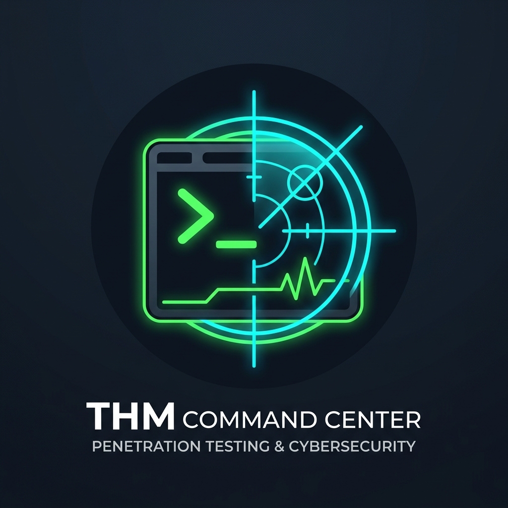

<div align="center">
  
  
  # 🎯 THM CTF Command Center

  **The ultimate local-first CLI environment for mastering TryHackMe & HackTheBox on Kali Linux.**

  [](https://www.gnu.org/software/bash/)
  [](https://sqlite.org/)
  [](https://www.kali.org/)
  [](LICENSE)

  <br>

  *Say goodbye to messy terminal tabs, lost scan outputs, and scattered notes.*
</div>

---

## ⚡ What is THM Command Center?

When tackling CTF rooms, managing terminal tabs, keeping track of targets, saving tool outputs, organizing loot, and maintaining notes can become an absolute nightmare.

**THM Command Center (`thm`)** solves this by acting as your personal hacking OS. It automatically tracks your commands, findings, flags, and targets in a blazing-fast local SQLite database. It organizes your files flawlessly and gives you instant, contextual awareness of your current engagement.

<br>

## 🧠 How It Works (For Beginners)

If you are new to CTFs, you might wonder why this tool is necessary. Here is the logic:

1. **The Old Way**: Normally, when hacking a machine, you have to `mkdir Overpass`, then `mkdir nmap`, then run `nmap -sC -sV 10.10.10.10 > nmap/scan.txt`. You open 5 terminal tabs, and have to remember the IP `10.10.10.10` in every single tab. If you find a password, you open `nano passwords.txt` and save it. It gets messy fast.
2. **The THM Command Center Way**: You just tell the tool you are starting a room: `thm start Overpass 10.10.10.10`. 
   - The tool creates the folders for you. 
   - It remembers the IP. 
   - When you type `thm nmap`, it knows to scan `10.10.10.10` and automatically saves the output text to the right folder. 
   - When you find a password, you just type `thm cred add admin secret123` and it is saved in a local database.

**In short**: You focus on the hacking, and the tool acts as your automated secretary, organizing your evidence and commands in the background!

<br>

## ✨ Killer Features

- 🧠 **Context-Aware Execution**: Define your room and target once (`thm start <room> <ip>`). Never type the IP again. The tool injects it automatically!
- 📂 **Auto-Structuring**: Instantly builds the perfect directory structure (`scans/`, `exploits/`, `loot/`, `reports/`, etc.) for every single room you tackle.
- ⏱️ **Automatic Command Logging**: Run tools using our universal wrapper (e.g., `thm nmap -sC -sV`) and the exact command, execution time, exit code, and raw output are permanently saved to your database and folders.
- 🔍 **Global Search Engine**: Forgot which room had that specific password or exploit? Just run `thm search <keyword>` to scan across your entire database of rooms, notes, history, and findings.
- 📓 **Entity Tracking**: Securely stash and track Flags, Notes, Findings, TODOs, and Credentials directly from your terminal.
- 🚀 **Tmux Hacker Dashboard**: Spawn a perfectly split 4-pane Tmux window (Main Shell, Exploitation, Enumeration, Notes) pre-configured for your active room instantly (`thm tmux`).
- 📄 **1-Click Markdown Reporting**: Generate beautiful executive summaries of your entire engagement with a single command (`thm report`).

---

## 🚀 Quick Start Guide

### 1️⃣ Installation
Drop this into your Kali Linux terminal to install the tool locally:
```bash
git clone https://github.com/Harsh-Sonker/THM-command-center.git
cd THM-command-center
chmod +x install.sh
./install.sh
```

### 2️⃣ Initialize the Engine
Run this command **once** after installing. It builds your global workspace (`~/TryHackMe/`) and initializes the SQLite database:
```bash
thm init
```

### 3️⃣ Start Hacking
To start a new room (e.g., "Overpass" with IP `10.10.10.10`), simply run:
```bash
thm start Overpass 10.10.10.10
```
*Boom.* Your workspace is created, your database context is set, and you are ready to go.

### 4️⃣ Work Like a Pro
You can now run commands natively. Outputs are logged and categorized automatically!
```bash
thm status                 # View your live dashboard (Room/Target/Tasks)
thm jump                   # Instantly drop a shell into the active room's folder
thm nmap -sC -sV           # Runs Nmap against your target; logs output to scans/
thm note add "Found a weird header..."  # Save a note securely
thm flag set user "THM{...}"            # Secure the flag!
thm finding add "SQLi on Login"         # Track vulnerabilities
```

---

## 📖 Comprehensive Documentation

Want to master every feature? We've got you covered:

- 📘 **[Read the Full User Guide](GUIDE.txt)**: A step-by-step walkthrough of the entire tool.
- 📝 **[Command Cheatsheet](CHEATSHEET.md)**: A quick reference for every single command available.
- 💻 **Interactive Manual**: Just type `thm manual` or `thm --help` in your terminal anytime!

---

## 🏗️ Architecture & Privacy

**100% Local. 100% Private.**
- **No APIs. No Cloud.** This tool operates completely offline on your local Kali machine. 
- **Workspace**: All your raw outputs and files are saved beautifully in `~/TryHackMe/`.
- **Database**: All your logs, history, and credentials are saved in `~/.local/share/thm/thm.db`.
- **Portability**: Want to move your data? Just run `thm export` or `thm backup`!

---

<div align="center">
  <i>Built with ❤️ by Hackers, for Hackers.</i>
</div>
